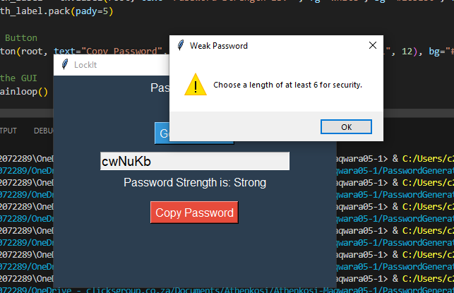
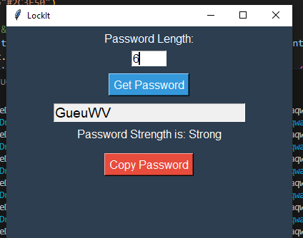
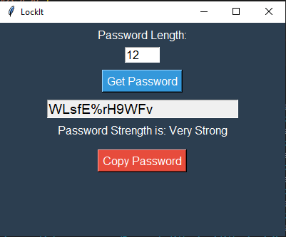

# Password Generator

###    Generates a random password based on the user-defined length.
###    Checks if the length is at least 6 for security reasons.
###    Updates the password field and its strength label.

## Weak Passwword

## Strong Password

## Very Strong Password

